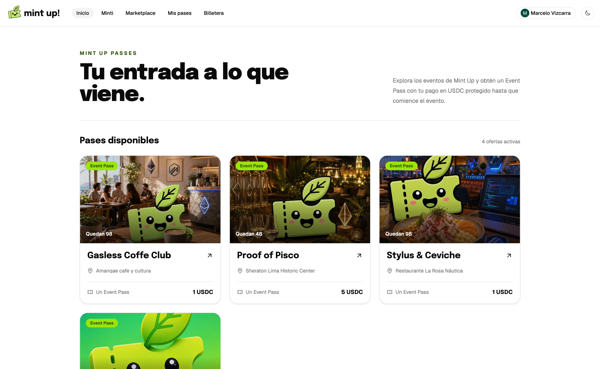
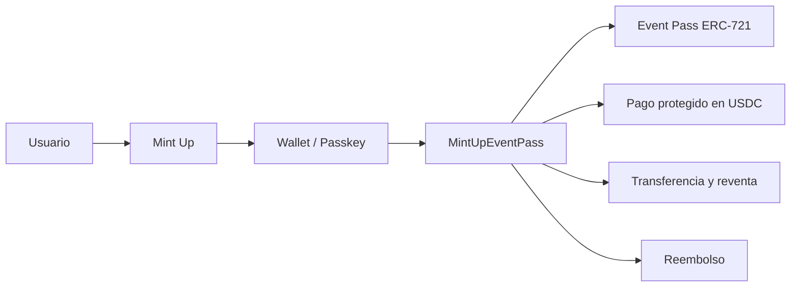

<h1 align="center">Mint Up Event Passes</h1>

  <strong>Tu entrada. Tu dinero. Tu control.</strong>

  Compra, revende y recupera tu dinero con confianza.

  
  
  

---

## 📺 Demo

[👉 Acceder a la aplicación](https://passes.mint-up.xyz) · [▶️ Ver video pitch](https://www.youtube.com/watch?v=7avPsmePueM)

---

## 💡 El problema

Después de comprar una entrada, el usuario pierde el control:

- **El evento se cancela:** recuperar el dinero puede tomar semanas o meses.
- **Ya no puede asistir:** revender implica confiar en desconocidos y exponerse a estafas.
- **La entrada cambia de manos:** no existe transparencia sobre quién es su propietario actual.

La escala del problema en Perú es real: más de **7,000 personas** fueron afectadas por entradas falsas en un solo concierto en Lima, una misma entrada fue revendida más de **360 veces** y el **50%** de los reportes de entretenimiento monitoreados por Indecopi entre 2020 y 2022 estuvieron relacionados con falta de reembolso.

---

## ✨ La solución

Mint Up convierte cada entrada en un **Event Pass verificable** y mantiene sus reglas críticas en Arbitrum:

- **Compra protegida:** el pago en USDC queda resguardado hasta que se cumplen las condiciones del evento.
- **Propiedad verificable:** cada Event Pass es un ERC-721 y su propietario actual puede comprobarse on-chain.
- **Reembolsos programables:** ante una cancelación, el contrato permite recuperar el pago sin depender de un proceso manual prolongado.
- **Transferencias seguras:** si el usuario entrega su pase, la propiedad cambia de forma verificable.
- **Reventa oficial:** comprador y vendedor liquidan la operación mediante el contrato, sin tener que confiar entre sí.
- **Check-in verificable:** el estado de asistencia queda registrado por un operador autorizado.

La propiedad, los fondos, los reembolsos, las transferencias y la reventa no son registros decorativos: forman el ciclo de vida principal del Event Pass dentro del smart contract.

---

## 🏗️ Cómo funciona

1. El organizador registra el evento, precio, inventario y reglas de venta.
2. El usuario paga en USDC y recibe un Event Pass ERC-721.
3. El contrato protege los fondos y registra la propiedad del pase.
4. El usuario puede transferirlo o publicarlo en la reventa oficial.
5. Si el evento se cancela, puede reclamar su reembolso mediante el contrato.
6. Si el evento se realiza, los fondos se liberan según las reglas programadas.

---

## 🛠️ Stack tecnológico

- **Smart contract:** Rust, Arbitrum Stylus SDK y OpenZeppelin Stylus.
- **Blockchain:** Arbitrum Sepolia, ERC-721, USDC y EIP-712.
- **Frontend:** Next.js 16, React 19, Tailwind CSS, wagmi y RainbowKit.
- **Backend:** Convex para autenticación y datos de aplicación; el contrato sigue siendo la fuente de verdad del Event Pass.
- **Complemento de IA:** Minti facilita el descubrimiento de eventos en lenguaje natural, pero no firma transacciones ni controla los pases.

### ¿Por qué Arbitrum?

- **Alto volumen:** cada compra, reventa, transferencia y reembolso puede convertirse en una transacción real.
- **Bajo costo:** las operaciones frecuentes deben seguir siendo económicamente viables.
- **Listo para producción:** el camino del producto es Arbitrum One, USDC nativo y contratos Stylus.

---

## 🏆 Integración Arbitrum Stylus

- **Lógica esencial en Stylus:** compra, minting, fondos protegidos, reembolsos, transferencias, check-in y reventa están implementados en Rust.
- **OpenZeppelin Stylus:** aporta las primitivas ERC-721, metadata e interfaces utilizadas por el contrato.
- **Scaffold Stylus:** el pipeline compila y despliega el contrato, y genera el ABI y las direcciones que consume Next.js.
- **Arbitrum Sepolia:** la demo pública utiliza un contrato desplegado y verificable.

| Campo | Valor |
| --- | --- |
| Red | Arbitrum Sepolia |
| Chain ID | `421614` |
| Event Pass | [`0xd4bb3ab927b26f5e2bad7456c04647b4940700e6`](https://sepolia.arbiscan.io/address/0xf38c46f74ced7b5b5784b8eed24a17bfafcac12d) |
| USDC | `0x75faf114eafb1BDbe2F0316DF893fd58CE46AA4d` |

### Evidencia técnica

- Contrato Stylus: [`packages/stylus/contracts/mint-up-event-pass/src/lib.rs`](packages/stylus/contracts/mint-up-event-pass/src/lib.rs)
- ABI: [`packages/stylus/contracts/mint-up-event-pass/abi/IMintUpEventPass.sol`](packages/stylus/contracts/mint-up-event-pass/abi/IMintUpEventPass.sol)
- Registro de despliegue: [`docs/event-pass-demo-deployment.json`](docs/event-pass-demo-deployment.json)
- Integración con Next.js: [`packages/nextjs/contracts/eventPassEnvironment.ts`](packages/nextjs/contracts/eventPassEnvironment.ts)

---

## 💼 Modelo de negocio

Mint Up gana cuando los organizadores venden:

- **5%** de comisión por Event Pass vendido.
- **9%** de comisión sobre reventas oficiales.

---

## 🔮 Roadmap

- **Hoy:** Event Passes, pagos en USDC, reventa y reembolsos en Arbitrum Sepolia.
- **Q4 2026:** producción en Arbitrum One y primeros eventos de pago reales con comunidades existentes.
- **Q1 2027:** pagos fiat y moneda local mediante Yape, Plin y tarjetas.
- **Q2 2027:** ticketing abierto a más organizadores y expansión a otros países.

Mint Up ya opera con usuarios, comunidades y eventos reales en [mint-up.xyz](https://mint-up.xyz). La hackathon acelera el siguiente capítulo del producto: Event Passes programables en Arbitrum.

---

## 👥 Equipo

- **Marcelo Vizcarra** - Full Stack Developer, más de 4 años construyendo soluciones modernas y escalables ([GitHub](https://github.com/mavix21) / [LinkedIn](https://www.linkedin.com/in/marcelo-vizcarra-7459841b1/))
- **Gianella Coronel** - Software Engineer, 5 años de experiencia y conocimiento en React y smart contracts ([GitHub](https://github.com/gianellacoronel) / [LinkedIn](https://www.linkedin.com/in/gianellacoronelmanchego/))
