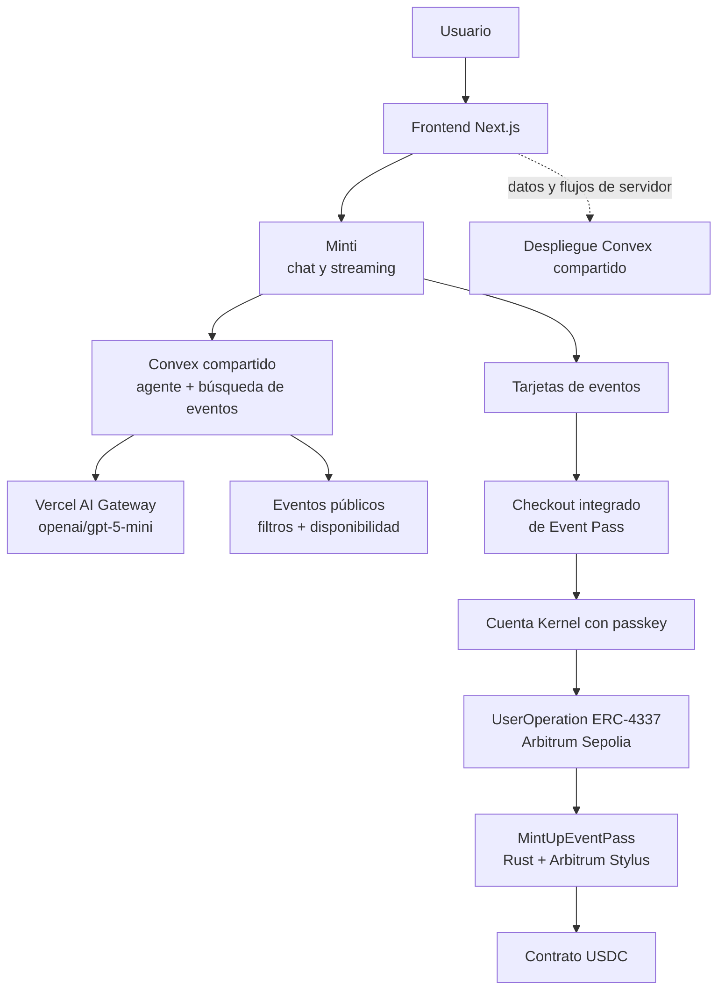

# Mint Up Event Pass

Mint Up es una aplicación de pases para eventos. El estado de los Event Pass y
las reglas de pago se ejecutan en un contrato Arbitrum Stylus escrito en Rust.
El repositorio incluye el contrato, la generación de ABI, las herramientas de
despliegue, el frontend Next.js y el flujo local de Nitro.

## 🏆 Requisitos de la hackathon

| Requisito | Estado | Implementación | Evidencia |
| --- | --- | --- | --- |
| Arbitrum como componente principal | ✅ | El estado de los Event Pass y la liquidación de pagos se ejecutan en `MintUpEventPass` sobre redes compatibles con Arbitrum. | `packages/stylus/contracts/mint-up-event-pass/src/lib.rs`, `packages/nextjs/contracts/eventPassEnvironment.ts` |
| Smart contracts en Arbitrum | ✅ | El proyecto soporta Nitro DevNode (`412346`) y Arbitrum Sepolia (`421614`), con un despliegue Sepolia registrado. | `packages/nextjs/utils/scaffold-stylus/supportedChains.ts`, `docs/event-pass-demo-deployment.json` |
| Arbitrum Stylus | ✅ | El contrato es un `cdylib` de Rust que utiliza `stylus-sdk` y `openzeppelin-stylus`. | `packages/stylus/contracts/mint-up-event-pass/Cargo.toml`, `src/lib.rs` |
| Lógica esencial en Stylus | ✅ | Compra, minting ERC-721, contabilidad USDC, reembolsos, check-in, transferencias y reventa están implementados en el contrato Stylus. | `packages/stylus/contracts/mint-up-event-pass/src/lib.rs` (`purchase`, `claim_refund`, `check_in`, `purchase_public_resale`) |
| Scaffold Stylus | ✅ | El despliegue genera el registro de ABI/direcciones que consume Next.js; la configuración de red y los hooks están en las utilidades de Scaffold Stylus. | `packages/stylus/scripts/deploy.ts`, `packages/nextjs/contracts/deployedContracts.ts`, `packages/nextjs/utils/scaffold-stylus/` |
| Inteligencia Artificial y Tecnologías Emergentes | ✅ | Minti interpreta consultas en lenguaje natural con tool calling y presenta tarjetas de eventos. Para eventos pagados de Mint Up, esas tarjetas integran un checkout de Event Pass que el usuario confirma con su passkey. | Chat y compra: `packages/nextjs/app/chat/`; backend de IA compartido: `mint-up-corp/packages/backend/convex/lib/mintiAgent.ts`, `mintiTools.ts`, `mintiEventSearch.ts` |

## ¿Por qué Arbitrum?

Arbitrum es el entorno de ejecución de la aplicación. La red local es un
Arbitrum Nitro DevNode con chain ID `412346` y RPC
`http://localhost:8547`. El entorno público de demostración es Arbitrum
Sepolia con chain ID `421614`.

El frontend selecciona el entorno mediante
`NEXT_PUBLIC_EVENT_PASS_ENVIRONMENT`. `eventPassEnvironment.ts` resuelve la
dirección del Event Pass y de USDC, mientras `scaffold.config.ts` selecciona la
red correspondiente. `wagmiConfig.tsx` y `wagmiConnectors.tsx` proporcionan el
transporte RPC y la conexión de wallet.

`MintUpEventPass` almacena la configuración de eventos, la propiedad de los
Event Pass, los saldos USDC protegidos, los nonces de autorización y los
listados de reventa. El código de verificación del frontend y del servidor
comprueba chain ID, direcciones y eventos emitidos usando el ABI generado.

## 🦀 ¿Por qué Stylus?

`MintUpEventPass` está escrito en Rust y compilado como contrato Arbitrum
Stylus. Ejecuta la lógica principal del producto:

- `register_event` valida ventanas de venta, cantidad máxima y metadata IPFS.
- `purchase` cobra USDC, actualiza el saldo protegido, genera el Event Pass
  ERC-721 y almacena su metadata.
- `claim_refund` y `release_funds` aplican las reglas de cancelación y
  liquidación diferida.
- `transfer_pass` usa autorizaciones EIP-712 de corta duración y `check_in`
  cambia el estado de asistencia.
- `create_public_resale_listing` y `purchase_public_resale` aplican las reglas
  de reventa y liquidan pagos del vendedor y comisiones.

Stylus no es un componente secundario o de demostración: el ciclo de vida
principal de los Event Pass está implementado en este contrato Rust. Sustituirlo
por Solidity implicaría otra implementación del producto, porque el contrato,
ABI, modelo de almacenamiento y pipeline de despliegue están construidos sobre
este crate Stylus. No se afirma aquí ninguna mejora de rendimiento o coste.

El contrato usa almacenamiento y macros de entrypoint de `stylus-sdk`, además
de las implementaciones ERC-721, metadata, EIP-712 e interfaces de OpenZeppelin
Stylus. Se compila mediante `cargo stylus build` desde
`packages/stylus/scripts/compile_event_pass.ts`.

## 🔎 Evidencia verificable

### Contrato Stylus

```text
packages/stylus/contracts/mint-up-event-pass/src/lib.rs
packages/stylus/contracts/mint-up-event-pass/src/main.rs
packages/stylus/contracts/mint-up-event-pass/Cargo.toml
packages/stylus/contracts/mint-up-event-pass/abi/IMintUpEventPass.sol
```

`lib.rs` contiene el almacenamiento `#[entrypoint]`, métodos públicos, llamadas
a USDC, integración ERC-721, eventos y tests Rust. `Cargo.toml` declara las
dependencias Stylus y OpenZeppelin Stylus.

### Configuración de Arbitrum

```text
packages/nextjs/utils/scaffold-stylus/supportedChains.ts
packages/nextjs/contracts/eventPassEnvironment.ts
packages/nextjs/scaffold.config.ts
packages/nextjs/services/web3/wagmiConfig.tsx
packages/stylus/.env.example
packages/nextjs/.env.example
```

Estos archivos contienen los chain IDs/RPC de Nitro y Sepolia, el selector de
entorno, las variables RPC y la dirección configurada de USDC.

### Despliegue y ABI

```text
packages/stylus/scripts/compile_event_pass.ts
packages/stylus/scripts/deploy_wrapper.ts
packages/stylus/scripts/deploy.ts
packages/stylus/scripts/deploy_contract.ts
packages/nextjs/contracts/deployedContracts.ts
```

`deploy.ts` despliega `mint-up-event-pass`, usa el USDC oficial de Arbitrum
Sepolia para la chain `421614` y genera el registro de ABI/direcciones usado
por el frontend.

Despliegue público registrado:

- Contrato: `0xf38c46f74ced7b5b5784b8eed24a17bfafcac12d`
- Red: Arbitrum Sepolia, chain ID `421614`
- Transacción: `0xf16ab268e147ecc407940dc08e25265ff069a574a0ecbe7765480ac80e9b5ee1`
- Explorer: `https://sepolia.arbiscan.io/address/0xf38c46f74ced7b5b5784b8eed24a17bfafcac12d`

### Integración del frontend

```text
packages/nextjs/contracts/eventPassEnvironment.ts
packages/nextjs/contracts/deployedContracts.ts
packages/nextjs/lib/event-pass-public-client.ts
packages/nextjs/lib/event-pass-purchase-server.ts
packages/nextjs/lib/event-pass-transactions.ts
packages/nextjs/components/passes/
packages/nextjs/lib/sponsored-operation-flow.ts
```

Next.js usa el ABI y las direcciones generadas para leer y verificar
transacciones y eventos de Event Pass. Convex gestiona datos de aplicación y
flujos de servidor; no es la fuente de verdad de propiedad o liquidación,
porque esos datos se verifican contra el contrato Arbitrum.

### Tests

```text
packages/stylus/contracts/mint-up-event-pass/src/lib.rs  # tests unitarios Rust
packages/stylus/scripts/local/test_event_pass.ts         # flujo E2E Nitro local
packages/stylus/scripts/__tests__/                       # validación ABI/despliegue
packages/nextjs/lib/*test.ts                             # tests frontend/servidor
packages/nextjs/components/passes/*test.tsx              # tests de UI
```

## 🏗️ Scaffold Stylus

`packages/stylus` contiene el contrato Rust y los scripts TypeScript de
compilación y despliegue. `packages/nextjs` contiene la interfaz, la
configuración wagmi, el registro generado de contratos y los hooks de Scaffold
Stylus. `deploy.ts` llama al helper de despliegue y escribe automáticamente el
ABI y las direcciones en `packages/nextjs/contracts/deployedContracts.ts`.

El entorno local del frontend usa Nitro por defecto. Para usar el despliegue
Sepolia, configura `NEXT_PUBLIC_EVENT_PASS_ENVIRONMENT=sepolia` y proporciona
`NEXT_PUBLIC_ARBITRUM_SEPOLIA_EVENT_PASS`.

## 🏛️ Arquitectura



- **Frontend:** interfaz Next.js y flujos de Event Pass en `packages/nextjs`.
- **Wallet:** conectores wagmi/RainbowKit y helpers de passkey/operaciones
  patrocinadas.
- **Arbitrum:** Nitro DevNode para desarrollo local o Arbitrum Sepolia para la
  demostración pública.
- **Contrato Stylus:** fuente autoritativa de propiedad, ciclo de vida,
  autorizaciones y liquidación de Event Pass.
- **USDC:** token de pago llamado por Stylus. En local se despliega
  `MockUsdc.sol`; Sepolia usa la dirección de Circle configurada.
- **Convex:** datos de aplicación y flujos de servidor externos configurados
  por `NEXT_PUBLIC_CONVEX_URL`; no es un despliegue de smart contract de este
  repositorio.
- **Minti:** interfaz conversacional en Next.js que usa Convex para
  autenticación, hilos, mensajes y búsqueda de eventos. Sus tarjetas de eventos
  pagados de Mint Up abren un checkout integrado y permite a los usuarios comprar Event Pass.

## 🔄 Flujo principal

1. El administrador registra un evento con `register_event`, incluyendo precio,
   cantidad, ventanas de tiempo, operador de check-in y metadata IPFS.
2. El usuario selecciona el evento en el frontend e inicia la compra. La app
   resuelve la dirección y red activa desde `eventPassEnvironment.ts`.
3. La wallet o el flujo de operación patrocinada envía la interacción al RPC
   de Arbitrum configurado.
4. `purchase` valida la venta, llama a `transferFrom` de USDC, registra el
   saldo protegido y genera el Event Pass ERC-721.
5. El contrato emite `EventPassPurchased`; la aplicación verifica el recibo,
   contrato y evento antes de mostrar el Event Pass.
6. Las acciones posteriores usan el mismo contrato Stylus para transferencias
   autorizadas, check-in, cancelación/reembolso, liberación de fondos o
   reventa.

## 📜 Smart contracts

### `MintUpEventPass`

```text
Lenguaje: Rust
Framework: Arbitrum Stylus SDK 0.9.0 + OpenZeppelin Stylus 0.3.0
Redes: Nitro DevNode (412346) y Arbitrum Sepolia (421614)
Ubicación: packages/stylus/contracts/mint-up-event-pass/src/lib.rs
```

Propósito: implementar el ciclo completo de Event Pass como colección
compatible con ERC-721, con reglas propias de movimiento, pagos y eventos.

Funciones principales: `register_event`, `purchase`, `claim_refund`,
`release_funds`, `transfer_pass`, `check_in`,
`create_public_resale_listing`, `purchase_public_resale`, `event_info`,
`pass_info` y `config`.

### `MockUsdc`

```text
Lenguaje: Solidity
Propósito: dependencia de pago solo local para el test E2E de Nitro
Ubicación: packages/stylus/scripts/local/MockUsdc.sol
```

Solo se selecciona para el chain ID `412346`; no es el token de pago de
producción.

## Configuración

### Requisitos previos

- Node.js y Yarn `3.2.3`, declarados en `package.json`.
- Rust/Cargo y `cargo-stylus`.
- Wallet y RPC de Arbitrum Sepolia para despliegues públicos.
- Docker no es necesario para el flujo local documentado.

### Instalación

```bash
cp packages/nextjs/.env.example packages/nextjs/.env.local
cp packages/stylus/.env.example packages/stylus/.env
```

No subas secretos al repositorio. Para Sepolia configura:

```env
# packages/nextjs/.env.local
NEXT_PUBLIC_EVENT_PASS_ENVIRONMENT=sepolia
NEXT_PUBLIC_ARBITRUM_SEPOLIA_EVENT_PASS=0x...

# packages/stylus/.env
ACCOUNT_ADDRESS_SEPOLIA=0x...
RPC_URL_SEPOLIA=https://...
PRIVATE_KEY_SEPOLIA=...
EVENT_PASS_ADMINISTRATOR=0x...
EVENT_PASS_AUTHORIZATION_SIGNER=0x...
EVENT_PASS_FEE_RECIPIENT=0x...
```

### Compilar y ejecutar localmente

### Desplegar en Arbitrum Sepolia

El script rechaza redes no soportadas, usa la dirección fija de USDC Sepolia,
guarda los registros en `packages/stylus/deployments/` y regenera la definición
de contratos del frontend.

## 🧪 Testing

`cargo test` cubre autorización, restricciones ERC-721, compra/minting,
reembolsos, contabilidad protegida, check-in y reventa. `test_event_pass.ts`
ejecuta el contrato desplegado en Nitro DevNode. Las validaciones de ABI y
entorno están en `packages/stylus/scripts/__tests__/`.

## 🚀 Despliegue

```text
Red: Arbitrum Sepolia
Chain ID: 421614
Event Pass: 0xf38c46f74ced7b5b5784b8eed24a17bfafcac12d
USDC: 0x75faf114eafb1BDbe2F0316DF893fd58CE46AA4d
Explorer: https://sepolia.arbiscan.io/address/0xf38c46f74ced7b5b5784b8eed24a17bfafcac12d
```

Estos valores provienen de `docs/event-pass-demo-deployment.json`. El registro
generado también contiene un despliegue local en chain ID `412346`; sus
direcciones pueden cambiar al reiniciar el devnode.

## 🤖 Minti — Asistente de eventos con IA

Minti es una interfaz conversacional integrada en Mint Up: combina descubrimiento
de eventos por lenguaje natural con una acción de compra disponible dentro de las
tarjetas de resultados. Por ello no es solo un chatbot informativo: ayuda a
encontrar un evento y permite abrir el checkout de su Event Pass sin salir de la
conversación. La confirmación de compra sigue siendo una acción explícita del
usuario con su passkey; el LLM no firma ni envía transacciones.

```text
Minti
 ├── 🔎 Buscar eventos
 ├── ℹ️ Presentar datos verificables de eventos
 └── 🎟️ Abrir el checkout de un Event Pass elegible
```

### Capacidades implementadas

#### 🔎 Descubrimiento de eventos

- Busca próximos eventos mediante lenguaje natural.
- Filtra por ventana temporal, formato (`online`, `in-person`, `hybrid`), mercado,
  distrito, categorías, tipo de precio y presupuesto máximo.
- Devuelve hasta 10 resultados con título, horario, zona horaria, formato,
  ubicación, organizador, categorías, precio, disponibilidad, distancia, imagen y
  URL canónica.
- Mantiene conversaciones autenticadas mediante hilos persistidos y muestra
  respuestas progresivas por streaming.
- Recomienda únicamente eventos devueltos por `searchEvents`; el prompt del agente
  prohíbe inventar IDs, precios, inventario o detalles.

#### 🎟️ Compra de Event Pass desde la conversación

- Las tarjetas de eventos que cumplen `platform === "mintup"` y tienen precio
  `paid` muestran el botón `Get pass`.
- El botón abre un checkout en un panel dentro de `/chat`; no redirige a otra
  pantalla de compra.
- El checkout consulta la oferta vigente por `eventId`, incluidos identificador
  on-chain, precio, disponibilidad, destinatario del pago y red.
- Solo se prepara una oferta cuando el backend comprueba un único tipo de entrada
  pagada, activo, de precio fijo y aprobación inmediata. La interfaz no permite
  elegir entre varios tipos de Event Pass ni cantidades.
- El usuario debe iniciar sesión y disponer de una cuenta Kernel/WebAuthn. Si no
  existe, el panel solicita registrar una passkey antes de comprar.

### Flujo técnico de búsqueda

```text
Usuario autenticado
  -> /chat y MintiChat (Next.js)
  -> createThread / sendMessage (Convex)
  -> Minti Agent (@convex-dev/agent)
  -> modelo openai/gpt-5-mini vía Vercel AI Gateway
  -> tool calling: searchEvents
  -> consulta Convex mintiEventSearch
  -> filtros deterministas sobre eventos públicos y proyecciones de precio
  -> resultado estructurado de eventos
  -> respuesta breve del modelo + tarjetas de eventos
  -> streaming persistido y mostrado en la interfaz
```

El contexto no procede de documentos indexados: procede del mensaje del usuario y
del resultado estructurado de `searchEvents`. Los hilos y mensajes se guardan en
el componente Agent de Convex.

### 🎟️ Compra de Event Pass con Minti

La compra se enlaza a los resultados de la conversación, no a un tool del agente.
El usuario identifica visualmente el evento en una tarjeta y el checkout utiliza
el `eventId` de esa tarjeta para resolver la oferta vigente.

```text
Usuario autenticado
  ↓ consulta en lenguaje natural
Minti + searchEvents
  ↓ tarjetas de eventos
Tarjeta de evento pagado de Mint Up
  ↓ botón Get pass
Checkout integrado en /chat
  ↓ oferta validada + revisión de precio
Cuenta Kernel con passkey
  ↓ confirmación biométrica y UserOperation ERC-4337 patrocinada
USDC approve exacto + MintUpEventPass.purchase(event_id)
  ↓ Arbitrum Sepolia
EventPassPurchased + verificación y conciliación
  ↓
Event Pass confirmado y acceso a /my-passes
```

1. El usuario pide a Minti eventos con restricciones expresadas en lenguaje
   natural. El agente invoca `searchEvents`; no hay una intención de compra
   separada ni una tool de compra en el modelo.
2. `EventRecommendationCard` renderiza los resultados. Si el evento pertenece a
   Mint Up y es pagado, muestra `Get pass`; en otro caso muestra `Ver evento`.
3. Al pulsar `Get pass`, `ChatEventPassPurchase` consulta
   `/api/event-pass-offers/[eventId]` y `/api/wallet/passkey`. La oferta aporta
   el evento, su identificador `bytes32`, precio, disponibilidad, contrato,
   USDC y red activa.
4. Si hace falta, `InlineSecureStep` registra una passkey y deriva la cuenta
   Kernel WebAuthn. Si la cuenta ya existe, `GaslessEventPassPurchase` prepara la
   compra para esa dirección.
5. Al pulsar `Obtener Event Pass`, el checkout autentica la solicitud, verifica
   la oferta vigente y el estado on-chain. Después muestra una revisión con el
   evento y el total en USDC.
6. El usuario confirma con Face ID o huella digital. La passkey firma una
   `UserOperation` ERC-4337 patrocinada; no se usa una extensión de wallet en
   este flujo.
7. La operación agrupa una aprobación de USDC por el importe exacto y la llamada
   `purchase(event_id)` de `MintUpEventPass`. La transacción se envía mediante
   la infraestructura de patrocinio y se espera su inclusión.
8. El backend verifica la `UserOperation`, el evento `EventPassPurchased`, la
   transferencia de USDC y la propiedad resultante del pase. Tras la conciliación
   se muestra la confirmación y el usuario puede abrir `/my-passes`.

El contrato `MintUpEventPass` es la fuente de verdad de la compra: valida venta,
ventana, inventario y pago; ejecuta `transferFrom` de USDC, acuña el ERC-721 y
emite `EventPassPurchased`.

### 💬 Ejemplo: comprar un Event Pass con Minti

Este ejemplo describe controles y datos que existen en la interfaz; no pretende
reproducir mensajes literales del modelo.

```text
Usuario:
"¿Qué eventos de Web3 están disponibles?"

Minti:
[respuesta breve y tarjetas devueltas por searchEvents]

Usuario:
[en la tarjeta de un evento pagado de Mint Up, pulsa "Get pass"]

Aplicación:
[abre el checkout en la conversación y muestra el evento y el precio]

Usuario:
[pulsa "Obtener Event Pass" y confirma con Face ID o huella digital]

Aplicación:
[espera la UserOperation, verifica la compra y confirma el Event Pass]
```

## 🧠 Inteligencia artificial y tecnologías emergentes

Minti aporta una capa de IA verificable dentro de un flujo funcional del producto,
no un mock visual. El LLM comprende solicitudes en lenguaje natural y decide
cuándo invocar `searchEvents` con argumentos validados por Zod. La búsqueda,
resolución de slugs, disponibilidad, precios y URLs se resuelven de forma
determinista en Convex. La interfaz presenta esos resultados como tarjetas y,
cuando la tarjeta representa un evento pagado elegible de Mint Up, habilita el
checkout de Event Pass.

```text
Lenguaje natural
  -> Minti: comprensión + generación + tool calling
  -> searchEvents: filtros validados
  -> Convex: eventos públicos, disponibilidad y precio
  -> tarjetas de eventos en Minti
  -> acción explícita del usuario: Get pass
  -> passkey + UserOperation ERC-4337
  -> Arbitrum Sepolia + MintUpEventPass.purchase
```

La IA funciona como capa conversacional sobre la experiencia Web3: reduce la
navegación manual para descubrir eventos y deja la acción de compra disponible en
el contexto de los resultados. La autorización, firma, envío y verificación no
las realiza el LLM; dependen del usuario, su passkey y la lógica Web3 de la dApp.
Esto preserva una confirmación explícita para la acción financiera mientras la IA
forma parte del recorrido que conduce a ella.

## 🔎 Evidencia verificable de IA

El frontend y el contrato están en este repositorio. El backend Convex que ejecuta
el agente pertenece al repositorio compartido `mint-up-corp`, configurado por
`NEXT_PUBLIC_CONVEX_URL`.

| Capacidad | Implementación | Evidencia |
| --- | --- | --- |
| Chat de IA | Composer, autenticación, hilos y renderizado de mensajes | `packages/nextjs/app/chat/_components/minti-chat.tsx` |
| Agente y modelo | `@convex-dev/agent`, `gateway("openai/gpt-5-mini")`, instrucciones y límite de pasos | `mint-up-corp/packages/backend/convex/lib/mintiAgent.ts` |
| Tool de búsqueda | `searchEvents`, con esquema Zod y consulta Convex | `mint-up-corp/packages/backend/convex/lib/mintiTools.ts` |
| Búsqueda de eventos | Filtros, geolocalización, precios y disponibilidad | `mint-up-corp/packages/backend/convex/mintiEventSearch.ts` |
| Tarjetas de resultados | Datos de evento y bifurcación entre `Get pass` y `Ver evento` | `packages/nextjs/app/chat/_components/event-recommendation-card.tsx` |
| Inicio de compra desde Minti | `ChatEventPassPurchase` abre el checkout integrado para el `eventId` de la tarjeta | `packages/nextjs/app/chat/_components/chat-event-pass-purchase.tsx` |
| Selección de Event Pass | El backend exige un único tipo pagado, activo, de precio fijo y aprobación inmediata | `mint-up-corp/packages/backend/convex/eventPassPurchases.ts` (`prepare`) |
| Wallet y confirmación | Cuenta Kernel/WebAuthn, passkey y firma de `UserOperation` | `packages/nextjs/components/passes/inline-secure-step.tsx`, `packages/nextjs/components/passes/gasless-event-pass-purchase.tsx` |
| Compra on-chain | Lote con `approve` exacto de USDC y llamada `purchase(event_id)` | `packages/nextjs/lib/event-pass-purchase-batch.ts` (`buildPurchaseBatchCalls`) |
| Smart Contract de compra | `MintUpEventPass.purchase` cobra USDC, acuña ERC-721 y emite `EventPassPurchased` | `packages/stylus/contracts/mint-up-event-pass/src/lib.rs` (`purchase`) |
| Verificación de compra | Verifica UserOperation, recibo, `EventPassPurchased`, pago USDC y propiedad | `packages/nextjs/lib/event-pass-purchase-server.ts` (`verifyEventPassPurchase`) |

## 🔗 Web3 + IA

Arbitrum y Stylus proporcionan la infraestructura descentralizada: el contrato
Rust `MintUpEventPass` controla propiedad, minting ERC-721, pagos USDC,
reembolsos, check-in y reventa. Minti añade lenguaje natural y resultados de
eventos a esa dApp. Las tarjetas producidas a partir de la búsqueda conectan el
descubrimiento conversacional con el checkout integrado para eventos pagados de
Mint Up.

La compra es on-chain, pero la IA no la ejecuta de forma autónoma. El usuario abre
el checkout desde una tarjeta, confirma con su passkey y firma la `UserOperation`;
la dApp verifica el resultado contra el contrato Stylus en Arbitrum Sepolia. Así,
Minti es la capa conversacional de acceso a un flujo Web3 con confirmación humana.

## 💬 Ejemplos de preguntas para Minti

### Descubrimiento de eventos

- `¿Qué eventos se realizarán esta semana?`
- `¿Qué eventos relacionados con Web3 están disponibles?`
- `Encuentra eventos en línea sobre inteligencia artificial.`
- `Muéstrame eventos gratuitos en Lima.`
- `¿Qué eventos presenciales están disponibles en Lima?`

### Información y restricciones de eventos

- `Encuentra eventos híbridos de blockchain con un presupuesto menor a 25 dólares.`
- `¿Qué eventos se realizarán el próximo mes?`
- `Muéstrame eventos de tecnología en Lima.`

Para comprar, el flujo implementado se inicia pulsando `Get pass` en la tarjeta de un
evento pagado de Mint Up.

## 🔄 Flujo de Minti (IA)

1. El usuario inicia sesión y escribe una consulta en `/chat`.
2. `MintiChat` crea o reutiliza un hilo y llama a `minti.sendMessage`.
3. Convex autoriza el hilo y `mintiAgent.streamText` envía el prompt al Agent.
4. `openai/gpt-5-mini`, vía Vercel AI Gateway, interpreta la consulta y puede
   invocar `searchEvents` dentro del límite configurado.
5. La herramienta valida y normaliza argumentos, y `mintiEventSearch` consulta
   eventos públicos usando filtros deterministas y datos de disponibilidad/precio.
6. El resultado estructurado vuelve al Agent; el modelo redacta una introducción
   sin inventar información.
7. Convex persiste deltas y mensajes; la UI los sincroniza y renderiza tarjetas.
8. Para una tarjeta pagada elegible de Mint Up, el usuario puede pulsar `Get pass`
   y continuar en el checkout integrado descrito arriba.

## 🧰 Stack tecnológico de IA

| Capa | Tecnología |
| --- | --- |
| Proveedor de IA | Vercel AI Gateway |
| Modelo | `openai/gpt-5-mini` |
| SDK | AI SDK `6.0.247` |
| Ejecución del agente | `@convex-dev/agent` `0.6.4` |
| Backend | Acciones, queries, componente Agent y base de datos de Convex |
| Frontend | Next.js / React, `MintiChat`, cliente React de Convex |
| Tool de IA | `searchEvents`, validada con Zod y de solo lectura |
| Acción Web3 vinculada | Checkout de Event Pass desde tarjetas elegibles; no es una tool del agente |
| Fuente de datos | Proyecciones públicas de eventos y taxonomía en Convex |
| Streaming e historial | Mensajes persistidos y streams sincronizados por Convex Agent |

## 🔐 Seguridad y configuración de la IA

- El cliente solo recibe `NEXT_PUBLIC_CONVEX_URL` y `NEXT_PUBLIC_CONVEX_SITE_URL`;
  la clave del proveedor no se expone al navegador.
- `AI_GATEWAY_API_KEY` se configura en el entorno server-side del backend Convex,
  según la configuración del proyecto compartido. No debe agregarse a este
  repositorio ni a `.env.example` del frontend.
- El backend autoriza el propietario de cada hilo antes de leer mensajes o enviar
  prompts (`minti.ts`).
- `searchEvents` es una herramienta de lectura; no tiene permisos para comprar,
  firmar ni llamar al contrato.
